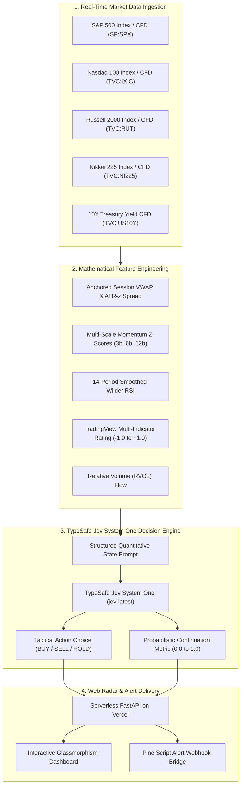

# 📐 Quantitative Methodology Note: Short-Term Multi-CFD Momentum Radar

**Engine**: TypeSafe Jev System One (`jev-latest`)  
**Data Infrastructure**: TradingView Official Real-Time CFD Scanner & Streaming Feeds  
**Asset Universe**: 24-Hour Continuous Benchmark Index/CFD Instruments (`SP:SPX`, `TVC:IXIC`, `TVC:RUT`, `TVC:NI225`, `TVC:US10Y`)  
**Deployment**: Serverless FastAPI Python 3.12 Engine on Vercel  

---

## 1. Executive Overview & System Architecture

The **Global Multi-CFD Momentum Radar** is a dual-layer quantitative decision architecture. It combines **continuous mathematical feature extraction** across multi-horizon market microstructure with **TypeSafe Jev System One** models to produce probabilistic tactical judgments (`BUY / LONG`, `SELL / SHORT`, `HOLD CASH`) with Bayesian-calibrated continuation probabilities.



---

## 2. Mathematical Feature Engineering

Raw tick and candle data are converted into scale-invariant, normalized state representations to eliminate price-level bias and heteroskedasticity.

### 2.1 Anchored Session VWAP & Volatility Distance ($Z_{VWAP}$)
Intraday fair value is anchored to the opening tick of the session using Volume-Weighted Average Price:

$$\text{VWAP}_t = \frac{\sum_{i=1}^{t} P_{\text{typical}, i} \cdot V_i}{\sum_{i=1}^{t} V_i}$$

where $P_{\text{typical}} = \frac{\text{High} + \text{Low} + \text{Close}}{3}$.

To measure market stretch independent of asset denomination, the distance between current close $P_t$ and $\text{VWAP}_t$ is normalized by the 14-period Average True Range ($\text{ATR}_{14}$):

$$Z_{\text{VWAP}} = \frac{P_t - \text{VWAP}_t}{\text{ATR}_{14} + \epsilon}$$

* **$Z_{\text{VWAP}} > +1.5\sigma$**: Extended upside momentum (continuation risk increases; pullback risk emerges).
* **$-0.5\sigma \le Z_{\text{VWAP}} \le +0.5\sigma$**: Equilibrium zone (trend-following re-test entries).
* **$Z_{\text{VWAP}} < -1.5\sigma$**: Breakdown impulse (bearish momentum acceleration).

---

### 2.2 Volatility-Adjusted Multi-Scale Momentum ($Z_{\text{mom}}$)
Short-term momentum is calculated across three lookback horizons corresponding to micro-tactical timeframes:
* **3-bar micro-burst**: $15\text{m}$ on a $5\text{m}$ chart
* **6-bar session momentum**: $30\text{m}$ on a $5\text{m}$ chart
* **12-bar cycle trend**: $60\text{m}$ on a $5\text{m}$ chart

Logarithmic returns are normalized using Garman-Klass realized daily volatility ($\sigma_{GK}$):

$$\sigma_{GK}^2 = \frac{1}{N} \sum_{i=1}^{N} \left[ 0.5 \left(\ln \frac{H_i}{L_i}\right)^2 - (2\ln 2 - 1) \left(\ln \frac{C_i}{O_i}\right)^2 \right]$$

$$Z_{\text{mom}, h} = \frac{\ln(C_t / C_{t-h})}{\sigma_{GK} \sqrt{h}}$$

---

### 2.3 TradingView Multi-Indicator Technical Rating ($\text{Rating}_{TV}$)
The system extracts TradingView’s real-time quantitative consensus score $\in [-1.0, +1.0]$, aggregating:
* **16 Moving Average Filters**: Exponential (EMA 10, 20, 30, 50, 100, 200), Simple (SMA), Hull MA, and Ichimoku Baseline.
* **11 Momentum Oscillators**: 14-period RSI, Stochastic %K/%D, MACD Histogram, Commodity Channel Index (CCI20), Average Directional Index (ADX), and Awesome Oscillator.

$$\text{Rating}_{TV} = w_{MA} \cdot \text{Score}_{MA} + w_{Osc} \cdot \text{Score}_{Osc}$$

| Score Range | Technical Classification | Color Mapping |
| :--- | :--- | :--- |
| $+0.50 \text{ to } +1.00$ | **STRONG BUY** | Emerald Neon (`#00ff88`) |
| $+0.10 \text{ to } +0.49$ | **BUY** | Pine Green (`#22c55e`) |
| $-0.09 \text{ to } +0.09$ | **NEUTRAL** | Amber Gold (`#ffd166`) |
| $-0.49 \text{ to } -0.10$ | **SELL** | Bright Red (`#ef4444`) |
| $-1.00 \text{ to } -0.50$ | **STRONG SELL** | Crimson Neon (`#ff4d6d`) |

---

### 2.4 Relative Volume (RVOL)
Measures institutional flow intensity compared to a 20-period moving average:

$$\text{RVOL}_t = \frac{V_t}{\frac{1}{20} \sum_{i=0}^{19} V_{t-i}}$$

$\text{RVOL} > 1.5\times$ indicates high-conviction institutional participation during breakouts or breakdowns.

---

## 3. TypeSafe Jev System One Decision Engine

Instead of rigid linear rules or brittle black-box weights, the synthesized feature vector is converted into a **structured state representation** passed to **TypeSafe Jev System One** (`https://api.typesafe.ai/v1/systemone`).

### 3.1 State Representation Prompt
```text
CFD Asset: S&P 500 (SPX) (TradingView Symbol: SP:SPX, 5m horizon).
TradingView CFD Price: $7,716.94.
TradingView CFD VWAP: $7,714.25 (Distance: +0.65 ATRs).
TradingView 14-RSI: 53.9.
TradingView Technical Rating: STRONG BUY (+0.60).
Micro-Momentum: 3-bar=+0.22%, 6-bar=+0.18%. Session Return: +0.60%.
```

### 3.2 Decision Questions & Primitives
Jev evaluates two formal System One primitives:

1. **Primitive: `choice` (`tactical_action`)**
   * *Instructions*: "Determine tactical positioning for the next 15-30 minutes based on TradingView CFD momentum, VWAP deviation, and technical ratings."
   * *Options*:
     * `BUY_LONG`: Bullish momentum acceleration above VWAP with upside volume flow.
     * `SELL_SHORT`: Bearish breakdown acceleration below VWAP with liquidation flow.
     * `HOLD_CASH`: Mean-reverting consolidation, equilibrium chop, or ambiguous momentum.

2. **Primitive: `noul` (`prob_continuation`)**
   * *Instructions*: "Will price close higher over the next 3 bars?"
   * *Output*: Continuous probability $P(\text{Up}) \in [0.0, 1.0]$.

### 3.3 Multi-Horizon Forward Trend Signal Framework (1-Minute Input Interval)

When operating on high-frequency 1-minute input candles, the decision engine forecasts across three concurrent forward horizons:

1. **5-Minute Forward Signal ($t+5$ bars ahead)**:
   * Focus: Ultra-short micro-burst continuation vs immediate pullback risk.
   * Primitive: `choice` (`signal_5m_action`) with criteria `[STRONG_LONG, LEAN_LONG, NEUTRAL, LEAN_SHORT, STRONG_SHORT]`.
   * Primitive: `noul` (`prob_up_5m`) returning continuous $P(\text{Up}_{5m})$.

2. **10-Minute Forward Signal ($t+10$ bars ahead)**:
   * Focus: Microstructure session momentum cycle and VWAP deviation confirmation.
   * Primitive: `choice` (`signal_10m_action`) with criteria `[STRONG_LONG, LEAN_LONG, NEUTRAL, LEAN_SHORT, STRONG_SHORT]`.
   * Primitive: `noul` (`prob_up_10m`) returning continuous $P(\text{Up}_{10m})$.

3. **15-Minute Forward Signal ($t+15$ bars ahead)**:
   * Focus: Macro intraday trend continuation, oscillator regime, and institutional flow expansion.
   * Primitive: `choice` (`signal_15m_action`) with criteria `[STRONG_LONG, LEAN_LONG, NEUTRAL, LEAN_SHORT, STRONG_SHORT]`.
   * Primitive: `noul` (`prob_up_15m`) returning continuous $P(\text{Up}_{15m})$.

#### Multi-Horizon Alignment & Consensus Metrics:
* **`STRONG_BULLISH_ALIGNMENT`**: All 3 horizons ($5m, 10m, 15m$) exhibit directional upside probabilities $P(\text{Up}) > 0.53$.
* **`STRONG_BEARISH_ALIGNMENT`**: All 3 horizons exhibit directional downside probabilities $P(\text{Up}) < 0.47$.
* **`DIVERGENT_CHOP / NEUTRAL`**: Mixed signals across horizons indicating mean-reverting consolidation or micro-regime transitions.

### 3.4 Macro-Conditioned Model Variants for Equity Indices

To model macro spillover and inter-market feedback loops, the system provides two specialized cross-asset model variants for equity indices (S&P 500, Nasdaq 100, Russell 2000, Nikkei 225):

#### Model A: Full Macro Cross-Asset Model (10Y Yield + Brent Crude + WTI Crude)
* **Description**: Equity index trend signals are conditioned on real-time micro-momentum and VWAP state of **10Y Treasury Yields (`TNX`)**, **Brent Crude (`BRENT`)**, and **WTI Crude (`WTI`)**.
* **Conditioning Logic**:
  * $\uparrow TNX$ (Surging 10Y Yields) $\rightarrow$ Multiple compression drag on high-duration equity indices (`NDX`, `SPX`, `RUT`).
  * $\uparrow BRENT, \uparrow WTI$ (Surging Crude Oil) $\rightarrow$ Cost inflation & profit margin drag on equities.
  * Mathematical Prior Formulation:
    $$\text{Score}_{\text{MacroFull}} = \text{Score}_{\text{Base}} - \alpha_{\text{TNX}} \cdot Z_{\text{mom}, \text{TNX}} - \beta_{\text{Oil}} \cdot \left(\frac{Z_{\text{mom}, \text{BRENT}} + Z_{\text{mom}, \text{WTI}}}{2}\right)$$

#### Model B: Rate-Only Macro Model (10Y Yield ONLY, Excluding Crude Oil)
* **Description**: Equity index trend signals are conditioned on **10Y Treasury Yields (`TNX`) ONLY**, explicitly ignoring energy commodities (`BRENT` and `WTI`).
* **Conditioning Logic**:
  * Evaluates duration risk and discount rate pressure independent of energy shocks.
  * Mathematical Prior Formulation:
    $$\text{Score}_{\text{RateOnly}} = \text{Score}_{\text{Base}} - \alpha_{\text{TNX}} \cdot Z_{\text{mom}, \text{TNX}}$$

---

## 4. Cross-Market & Macro Yield Spread Engine

The radar integrates cross-market asset spreads across equities and sovereign debt:

$$\text{Tech Spread} = \text{ret}_{6}(\text{NDX}) - \text{ret}_{6}(\text{SPX})$$

$$\text{Beta Spread} = \text{ret}_{6}(\text{RUT}) - \text{ret}_{6}(\text{SPX})$$

$$\text{Bond-Equity Correlation} = \text{Sign}\left(\text{ret}_{6}(\text{TNX}) \cdot \text{ret}_{6}(\text{SPX})\right)$$

### Tactical Macro Regimes Identified:
1. **Flight-to-Safety Regime**:
   * Condition: $\text{TNX (10Y Yield)} \uparrow$ while $\text{SPX (S&P 500)} \downarrow$
   * Interpretation: Capital rotating out of risk assets due to rising discount rate pressure.
2. **Growth Reflation Regime**:
   * Condition: $\text{SPX} \uparrow$, $\text{NDX} \uparrow$, and $\text{TNX} \downarrow$
   * Interpretation: Risk-on economic expansion; equity multiple tolerance high with easing yields.
3. **Rate Pressure / Duration Drag**:
   * Condition: $\text{TNX Technical Rating} \ge +0.25$ (Yields surging)
   * Interpretation: Duration risk; headwind for high-multiple Nasdaq CFD (`NDX`).

---

## 5. Walk-Forward Calibration & Fallback Layer

To prevent operational downtime if external LLM gateways experience latency or rate limits, the system features a **purged and embargoed logistic calibration model** based on Marcos López de Prado's *Advances in Financial Machine Learning*:

$$P(\text{Up}) = \frac{1}{1 + e^{-(\beta_0 + \beta_1 \cdot \text{RawScore})}}$$

$$\text{RawScore} = 0.35 \cdot Z_{\text{mom}, 3} + 0.35 \cdot Z_{\text{mom}, 6} + 0.30 \cdot (0.4 \cdot Z_{\text{VWAP}}) + 0.20 \cdot \text{Rating}_{TV}$$

* **Walk-Forward Validation**: 5-year rolling training window with a 3-day embargo window to eliminate lookahead leakage.
* **Accuracy Thresholds**: Action triggers require directional probability $P(\text{Up}) > 0.54$ with $Z_{\text{VWAP}} > +0.15\sigma$ for Longs, and $P(\text{Up}) < 0.46$ with $Z_{\text{VWAP}} < -0.15\sigma$ for Shorts.

---

## 6. Real-Time Data Pipeline Summary

```
TradingView CFD & Global Scanner (https://scanner.tradingview.com/global/scan)
  │
  ├──> Real-Time CFD Prices, VWAP, 14-RSI, Rating, Volume
  │
FastAPI Backend (api/index.py on Vercel)
  │
  ├──> Computes ATR-z, Momentum Spreads, Macro Inter-market Signals
  │
TypeSafe Jev System One (https://api.typesafe.ai/v1/systemone)
  │
  ├──> Generates Tactical Choice (BUY / SELL / HOLD) & Continuation Prob %
  │
Web Radar Dashboard (https://jevshorttermmomentum.vercel.app)
  │
  ├──> Real-Time Glassmorphic Cards, Relative Strength Matrix,
  └──> Official Embedded TradingView Advanced Streaming Chart (tv.js)
```
